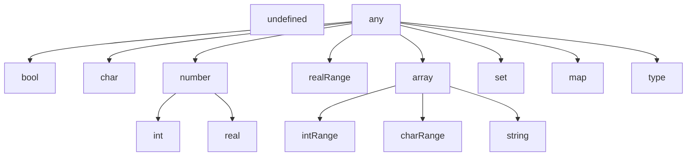

# Why even bother?

You may be asking: why did I even bother to create an interpreter for a language that isn't better in most areas than ones people usually use?
Well, putting the optimizations and complexity aside, it was quite a fun ride coming up with a syntax that feels right and figuring out how to implement my ideas.

It all started because of my other project [Granite](https://github.com/pChochura/Granite) - a very simple text editor with Markdown support.
Then I thought that using the code block in the editor it would be nice to compile a small script when needed. But hooking up a full-fladged compiler to that projects seemed like an overkill. So as an excercise I attempted to create my own *small* scripting language.
As the name "Granite" is a omage to the great Obsidian, thus the child of that could be non other than a rock that is contained inside of it - "Mica".

At this stage Mica supports basic functions with default parameter values, custom objects (like a structure) with properties and methods, string templates, generic parameters for functions (with some constraints) and a lot more.

# Example editor

I created a sample project with Kotlin Multiplatform support to showcase the abilities of the interpreter.

The js target is published and you can check out the demo [here](https://micalang.netlify.app)

# Documentation

<details>
  <summary>Grammar synopsis</summary>

```abnf
symbol                  = [a-zA-Z_] [a-zA-Z0-9_]*
type                    = "int" | "real" | "char" | "string" | "bool"
                            | "intRange" | "realRange" | "any"
                            | "type"
                            | ( "[" type "]" ) | ( "{" type "}" )
                            | ( "{" type ":" type "}" )

boolLiteral             = "true" | "false"
charLiteral             = "'" . "'"
stringLiteral           = "\"" ( interpolatedExpression | .* )* "\""
interpolatedExpression  = "$(" expression ")"
intLiteral              = [0-9] [0-9_]*
realLiteral             = intLiteral "." intLiteral
hexLiteral              = "0x" [0-9a-fA-F]+
binaryLiteral           = "0b" [0-1]+
exponentLiteral         = ( intLiteral | realLiteral ) "e" "-"? intLiteral
intRangeLiteral         = intLiteral ".." intLiteral
realRangeLiteral        = realLiteral ".." realLiteral
arrayLiteral            = "[" ( expression ( "," expression )* ","? )? "]"
setLiteral              = "{" ( expression ( "," expression )* ","? )? "}"
mapLiteral              = "{" ( ( expression ":" expression ) ( "," ( expression ":" expression ) )* ","? )? "}"

functionCallExpression  = symbol ( "@" type ) "(" ( expression ( "," expression )* ","? )? ")"

expressionBlockBody     = expressionStatement | ( "{" statement* expressionStatement "}" )
ifConditionExpression   = "if" expression expressionBlockBody ( "else if" expressionBlockBody )? "else" expressionBlockBody
affixationExpression    = ( symbol ( "++" | "--" ) ) | ( ( "++" | "--" ) symbol )
memberAccessExpression  = expression "." ( symbol | functionCallExpression )
typeCoercionExpression  = expression "as" type

expression              = boolLiteral | charLiteral | stringLiteral
                            | intLiteral | realLiteral | hexLiteral
                            | binaryLiteral | exponentLiteral | intRangeLiteral
                            | realRangeLiteral | arrayLiteral | setLiteral | mapLiteral
                            | functionCallExpression
                            | ifConditionExpression
                            | affixationExpression
                            | ( expression "[" expression "]" )
                            | ( "(" expression ")" )
                            | ( ( "-" | "+" | "!" ) expression )
                            | ( expression ( "+" | "-" | "*" | "/" | "^" | "&" | "|" ) expression )

declarationStatement    = symbol ( ":" type )? "=" expression
assignmentStatement     = symbol ( "=" | "+=" | "-=" | "*=" | "/=" | "^=" | "&=" | "|=" ) expression
returnStatement         = "return" expression?
breakStatement          = "break"

blockBody               = statement | ( "{" statement* "}" )

ifConditionStatement    = "if" expression blockBody ( "else if" blockBody )? ( "else" blockBody )?
loopIfStatement         = "loop" ( "if" expression )? blockBody ( "else" blockBody )?
loopInStatement         = "loop" symbol ( "," symbol )? "in" expression blockBody
expressionStatement     = expression
userInputStatement      = "<" symbol
userOutputStatement     = ">" expression

statement               = declarationStatement | assignmentStatement
                            | returnStatement | breakStatement
                            | ifConditionStatement | loopIfStatement | loopInStatement
                            | expressionStatement
                            | userInputStatement | userOutputStatement

functionDeclaration     = symbol ( "@" type ) "(" ( symbol ":" type ( "=" expression )? ( "," symbol ":" type ( "=" expression )? ","? )* )? ")" ( ":" type )? "{" statement* "}"
typeDeclaration         = type symbol "{" ( symbol ":" type )* functionDeclaration* "}"

rootLevelStatement      = statement | functionDeclaration | typeDeclaration
```
</details>

## Types

Mica language is strongly typed and all of the types are resolved at compile time.
They extended each other and can be used in a polymorphic scenarios (i.e. a string literal can be  used as an array).

A tree of all of the supported types:



Notice the entry **type** which is a special keyword used to create custom types with similar usages to a *struct* in C.

## Variable declaration

To declare a variable you need to specify the name and optionally a type of that variable followed as well as the value assigned to it.
If you omit the type, it will be inferred as the most specific one in the types tree.

```kotlin
a: int = 1 // a: number = 1 is also valid

// this will be inferred as [number] as the common type between 1 and 1.2 is number
b = [1, 1.2]

// you can cast the value to be of a specific type
c = ['a', 'b'] as [any] // without the cast it would be inferred as [char]

// in case of arrays, sets and maps you have a way of creating an empty container
// that won't collide with the assigned type
emptyArray: [intRange] = []
emptyArray2 = [] // it will be inferred as [any]

emptySet: {real} = {}

emptyMap: {int:real} = {:}

// ranges can be created using the .. operator
range1 = 5..10
range2 = 10..5 // the order matters

// a string literal supports interpolation
text = "A range of $(range1) is basically an array of $([5, 6, 7, 8, 9, 10])"

// various formats of a number are supported
// they are converted to int or real
scientificNotation = 35e-2 // 0.35
hex = 0xfff // 4095
binary = 0b1101 // 13
```

## Operators

Mica lang supports most of the common operators and the value is computed using a Pratt parser implementation (https://matklad.github.io/2020/04/13/simple-but-powerful-pratt-parsing.html).

### Unary operation

An operation that has only one argument (either on the left or the right side of the operand).

- unary plus
  ```kotlin
  a = +5
  ```
- unary minus
  ```kotlin
  a = -5
  ```
- pre-/post-increment
  ```kotlin
  a = 10
  b = ++a // b = 11 and a = 11
  b = a++ // b = 11 and a = 12
  ```
- pre-/post-decrement
  ```kotlin
  a = 10
  b = --a // b = 9 and a = 9
  b = a-- // b = 9 and a = 8
  ```
- negation
  ```kotlin
  a = true
  b = !a
  ```

### Binary operation

An operation that consists of two arguments and an operand inbetween.

- add
  ```kotlin
  a = 10 + 5
  ```
- subtract
  ```kotlin
  a = 10 - 5
  ```
- multiply
  ```kotlin
  a = 10 * 5
  ```
- divide
  ```kotlin
  a = 10 / 4 // this is an int division
  b = 10.0 / 4 // this is a real division
  ```
- modulo
  ```kotlin
  a = 10 % 4
  b = 10.5 % 4
  ```
- exponent
  ```kotlin
  a = 10 ^ 5
  b = 2.2 ^ 3
  c = 2 ^ 3.14
  ```
- range
  ```kotlin
  a = 21..37
  b = 69..67
  c = 2.72..3.14
  d = 'a'..'f'
  ```
- equals
  ```kotlin
  a = 10 == 5
  ```
- not equal
  ```kotlin
  b = 10 != 5
  ```
- less than / or equal
  ```kotlin
  a = 10 < 5
  b = 10 <= 5
  ```
- greater than / or equal
  ```kotlin
  a = 10 > 5
  b = 10 >= 5
  ```
- and
  ```kotlin
  a = true & (100 == 1)
  b = false & a
  ```
- or
  ```kotlin
  a = false | (3.14 > 420)
  ```

## Functions

A function is a set of instructions that can be executed with specific arguments on demand.
```kotlin
main() {
  > "Hello, World!"
}
```


Functions by default can be called as member functions if they have a parameter.

```kotlin
print(text: string = "default") {
  > text
}
print("Hello, world")
print()

add(a: int, b: int): int { return a + b }
> add(34, 35)
// The first parameter can always be used as a receiver argument of the function (unless ! is used)
> 34.add(35)

add!(a: int, b: int) {}
add(34, 35)    // correct
// 34.add(35)  // incorrect

count(..items: [int]): int {
  return items.length
}
> count(1, 4, 10)
> count()

// `type` is a generic placeholder with a temporary value of `[char]` as the type parameter forces
f1@[char](a: [type], idx: int): type {
  return a[idx]
}
f2(a: [[char]], idx: int): [char] {
  return a[idx]
}
> f1(["abc"], 0)
> f2(["abc"], 0)

// Explicitly [char]
> f1@[char](["abc"], 0)
```

### Type declaration

```kotlin
type intPair {
  first: int
  second: int

  length(): int {
    return maxOf(
      first,
      second,
    ) - minOf(
      first,
      second,
    )
  }
}

pair = intPair(3, 99)
// length(pair) is not allowed here
> pair.length()
> "$(pair.first)..$(pair.second)"

type intTriple : intPair {
  // You have to override all of the parent's properties matching their name and type exactly
  first: int
  second: int
  third: int
}

triple = intTriple(1, 2, 3)
> triple
// The original function treats `triple` as its parent type
> triple.length()
```

### If expression / statement

```kotlin
fun(): bool { > "called" return true }
if 34 + 35 == 69
  > "one liner"
else if fun() {
  > "fun wasn't called if the earlier condition was true"
} else {
  > "nothing matched"
}

// The last statement in the body should be an expression
a = if true 0 else 1
b = if false {
  123
} else if false {
  455
} else {
  789
}
// This will raise an error. It has to have the else branch
// c = if true 0
```

### Loop statement

```kotlin
loop {
  > "this will loop forever or until the break/return keywords"
  if randomBool() break
}

// Else statement is only applicable to the `loop if` variant
loop if randomBool() {
  > "this will loop until the condition is true"
} else {
  > "this will execute when the first condition check resulted in false"
}

loop item in [1, 2, 3] {
  > "this will loop over the items $(item)"
}

loop i, index in "text"
  > "string is an array under the hood $(index): $(i)"
```

### Built-in functions

The signature of the function described how it can be invoked. If the function has a receiver type, it must be called as a member function:
```kotlin
// [number].min(): number
> [1, 2, 3].min() // correct
> min([1, 2, 3])  // incorrect
```

On the other hand, if it doesn't, in most cases it can be called in both ways:

```kotlin
// length([any]): int
> ['a', 5].length() // correct
> length(['a', 5])  // correct
```

There is also a special case when the caller is forced not to use the function member call. You can specify that by adding a `!` after the function name:

```kotlin
// minOf!(..[number]): number
// typeOf!(any): string 
> typeOf(5)  // correct
> 5.typeOf() // incorrect

// You can declare your own function
fun!(a: int) {}
```

#### Type conversion

The type conversion functions loosely convert the values between the types. If you want to explicitly force the value to be a certain type, use type coercion `value as type`.
The types for the array, set and the map are inferred based on the incoming argument types.

```kotlin
// (
//   int | bool,
// ).toBool(): bool
> 5.toBool()

// (
//   int | real | bool | char
// ).toInt(): int
> 3.5.toInt()
> true.toInt()
> 'a'.toInt()

// (
//   int | real
// ).toReal(): real
> 69.toReal()

// (
//   int | char
// ).toChar(): char
> 69.toChar()

// (
//   intRange | realRange | charRange
// ).toIntRange(): intRange
> (1.5..2.5).toIntRange()
> ('a'..'c').toIntRange()

// (
//   intRange | realRange
// ).toRealRange(): realRange
> (1..5).toRealRange()

// (
//   intRange | charRange
// ).toCharRange(): charRange
> (69..70).toCharRange()

// (
//   string | [any] | {any} |
//   intRange | charRange
// ).toArray(): [type]
> "hello".toArray()
> { 1, 2, 3 }.toArray()
> (5..2).toArray()
> ('g'..'d').toArray()

// (
//   string | [any] | {any} |
//   intRange | charRange
// ).toSet(): {type}
> "AHH".toSet()
> [1, 2, 2, 3].toSet()
> (1..5).toSet()
> ('d'..'a').toSet()

// (
//   { any:any }
// ).toMap(): { type:type }
> { 1: "value", 2: "other" }.toMap()

// any.toString(): string

// It is used to convert between types in a deep manner
// type.to@any(): type
> 3.13159265.to@int()
> ['t', 'w', 'o'].to@[int]()
> [70, 69].to@[char]()
> {
    [1, 2]: "one",
    3..4: [116, 119, 111],
  }.to@{[int]:[char]}()
```

#### Type relation

```kotlin
// typeOf!(any): string
> typeOf("hello")
> typeOf({ 1: "one", "2": 2 })

// any.isSubtypeOf(string): bool
> "hello".isSubtypeOf("[char]")
> (1..2).isSubtypeOf(typeOf([1]))

// any.isSubtypeOf@any(): bool
> ('a'..'d').isSubtypeOf@[any]()
```

#### String extensions

```kotlin
// string.contains(
//   string | char,
//   bool = false,
// ): bool
> "hello".contains("hell")
> "aHh".contains("AHH", true)
> "one".contains('n')

// string.startsWith(
//   string | char,
//   bool = false,
// ): bool
> "hi there".startsWith("hi")
> "Hello world".startsWith("hello", true)
> "Hi, mom!".startsWith('h', true)

// string.endsWith(
//   string | char,
//   bool = false,
// ): bool
> "hello, world".endsWith("world")
> "nah".endsWith("NAh", true)
> "heh".endsWith('h')

// string.indexOf(
//   string | char,
//   bool = false,
// ): int
> "text".indexOf("xt")
> "text".indexOf("T", true)
> "text".indexOf('e')

// string.lowercase(): string
> "Hello".lowercase()

// string.uppercase(): string 
> "nice".uppercase()
```

#### Set extensions

```kotlin
// length({any}): int
> { 'h', 'e', 'l', 'l' }.length()

// {type}.remove(type): bool
// Returns true if the element was successfully removed
> "hell".toSet().remove('j')

// {any}.clear()
a = { 1, 2 }
a.clear()
> a

// {type}.insert(type)
a.insert(5)
> a

// {type}.contains(type): bool
> a.contains(5)
```

#### Range extensions

```kotlin
// realRange.contains(real): bool
> (1.0..3.14).contains(3.0)

// realRange.min(): real
> (1e5..2e6).min()

// realRange.max(): real
> (1e5..2e6).max()
```

#### Map extensions

```kotlin
// {type:any}.keys(): [type]
> { 1: 'a', 2: 'b' }.keys()

// {any:type}.values(): [type]
> { 1: 'a', 2: 'b' }.values()

// {type:any}.containsKey(type): bool
> { 1: 'a' }.containsKey(2)

// {any:type}.containsValue(type): bool
> { 1: 'a' }.containsValue('a')

// {type:type2}.remove(type): type2
// Returns the value for that key if it was successfully removed
a = { 1: 0, 2: 1 }
> a.remove(1)
> a

// {type:type2}.put(type, type2)
a.put(5, 9)
> a
```

#### Custom types extensions

```kotlin
// type.setProperty(string, any)
// where `type` is a user defined type
type a {
  value: real
}
a = a(3.14)
a.setProperty("value", 7.0)
> a
```

#### Array extensions

```kotlin
// length([any]): int
> [1, 2].length()

// [type].remove(type): bool
a = [1, 2, 9, 6, 2]
> a.remove(1)

// [type].removeAt(int): type
> a.removeAt(0)

// [type].insertAt(int, type)
a.insertAt(0, 6)
> a

// [type].insert(type)
a.insert(9)
> a

// [type].contains(type): bool
> a.contains(5)

// [type].indexOf(type): int
> a.indexOf(9)

// sort([any])
// Sorts the array in place
a.sort()
> a

// [type].sorted(): [type]
// Creates a sorted copy of the array 
b = [4.0, 2.5, 9.1, 6.7, 1.1]
> b.sorted()
> b

// [number].min(): number
> a.min()
> b.min()

// minOf!(..[number]): number
> minOf(2, 5, 1, 9)
> minOf(5.5, 3e-2)

// [number].max(): number
> a.max()
> b.max()

// maxOf!(..[number]): number
> maxOf(2, 5, 1, 9)
> maxOf(5.5, 3e-2)

// join([any], string = ", "): string
> a.join()
> b.join(";")

// deepJoin([any], string = ", "): string
c = [[1, 2, 3], 5, 9, "ABC"]
> c.join()
> c.deepJoin()

// array!(int, type): [type]
// Creates an array of the provided size with its values as provided
d = array(5, "a")
> d

// [type].fill(type)
d.fill("AAA")
> d
```

#### Extensions

```kotlin
type a {
  array: [int]
}

// copy(type): type
a = a([1, 2])
b = a.copy()
a.array[0] += 7
> a
> b

// deepCopy(type): type
// This function is more expensive but it makes sure all of the nested values are copied
a = a([1, 2])
b = a.deepCopy()
a.array[0] += 7
> a
> b
```

#### System extensions

```kotlin
// setSeed!(int)
setSeed(5)

// randomInt!(int): int
// randomInt!(int, int): int
// randomInt!(intRange): int
> randomInt(5)
> randomInt(5, 10)
> randomInt(7..9)

// randomReal(real): real
// randomReal(real, real): real
// randomReal(realRange): real
> randomReal(3.14)
> randomReal(4.0, 5.0)
> randomReal(2.0..2.1)

// randomBool(): bool
> randomBool()

// random([type]): type
> random([1, 2, "a", 'c'])
```

### Built-in properties

#### Range extensions

```kotlin
// intRange.start: int
> (1..5).start

// intRange.end: int
> (6..9).end

// realRange.start: real
> (1.0..3.14).start

// realRange.end: real
> (6.9..8.1).end
```

#### Array extensions

```kotlin
// [any].length: int
> [1, "a", 'c'].length
```
