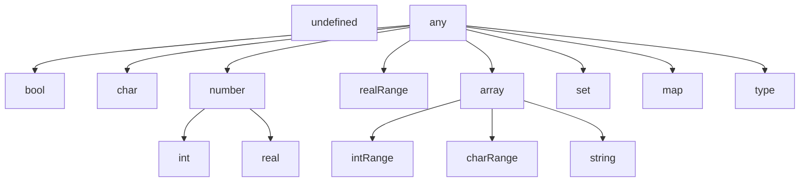

# Mica

An interpreted language used for scripting inside of the markdown renderer.


# Why even bother?

You may be asking: why did I even bother to create an interpreter for a language that isn't better in most areas than ones people usually use?
Well, putting the optimizations and complexity aside, it was quite a fun ride coming up with a syntax that feels right and figuring out how to implement my ideas.

It all started because of my other project [Granite](https://github.com/pChochura/Granite) - a very simple text editor with Markdown support.
Then I thought that using the code block in the editor it would be nice to compile a small script when needed. But hooking up a full-fladged compiler to that project seemed like an overkill. So as an excercise I attempted to create my own *small* scripting language.
As the name "Granite" is a omage to the great Obsidian, thus the child of that could be non other than a rock that is contained inside of it - "Mica".

At this stage Mica supports basic functions with default parameter values, custom objects (like a structure) with properties and methods, string templates, generic parameters for functions (with some constraints) and a lot more.

# Example editor

I created a sample project with Kotlin Multiplatform support to showcase the abilities of the interpreter.

The js target is published and you can check out the demo [here](https://micalang.netlify.app)

# Installation


[](https://maven-badges.sml.io/sonatype-central/io.github.pchochura/mica/)

settings.gradle.kts: 
```kotlin
pluginManagement {
  repositories {
    mavenCentral()
  }
}
```

gradle.kts:
```kotlin
dependencies {
  implementation("io.github.pchochura:mica:{LATEST_VERSION}")
}
```

# Usage

The library allows you to execute the code on demand.
After creating an instance of *Mica* interpreter and providing the input and output callbacks, you can call the execute method which is a suspend function.

```kotlin
val coroutineScope = rememberCoroutineScope()
var outputState by remember { mutableStateOf(listOf<String>()) }
val mica = remember {
  Mica(
    onOutputCallback = {
      outputState += "> $it"
    },
    onInputCallback = {
      "Some input which can be provided in various ways"
    },
  )
}

Button(
  onClick = {
    coroutineScope.launch {
        isLoading = true
        outputState = emptyList()
        mica.execute("source code of Mica")
    }
  },
)
```

# Documentation

<details>
  <summary>Grammar synopsis</summary>

```abnf
symbol                  = [a-zA-Z_] [a-zA-Z0-9_]*
type                    = "int" | "real" | "char" | "string" | "bool"
                            | "intRange" | "realRange" | "any"
                            | "type"
                            | ( "[" type "]" ) | ( "{" type "}" )
                            | ( "{" type ":" type "}" )

boolLiteral             = "true" | "false"
charLiteral             = "'" . "'"
stringLiteral           = "\"" ( interpolatedExpression | .* )* "\""
interpolatedExpression  = "$(" expression ")"
intLiteral              = [0-9] [0-9_]*
realLiteral             = intLiteral "." intLiteral
hexLiteral              = "0x" [0-9a-fA-F]+
binaryLiteral           = "0b" [0-1]+
exponentLiteral         = ( intLiteral | realLiteral ) "e" "-"? intLiteral
intRangeLiteral         = intLiteral ".." intLiteral
realRangeLiteral        = realLiteral ".." realLiteral
arrayLiteral            = "[" ( expression ( "," expression )* ","? )? "]"
setLiteral              = "{" ( expression ( "," expression )* ","? )? "}"
mapLiteral              = "{" ( ( expression ":" expression ) ( "," ( expression ":" expression ) )* ","? )? "}"

functionCallExpression  = symbol ( "@" type ) "(" ( expression ( "," expression )* ","? )? ")"

expressionBlockBody     = expressionStatement | ( "{" statement* expressionStatement "}" )
ifConditionExpression   = "if" expression expressionBlockBody ( "else if" expressionBlockBody )? "else" expressionBlockBody
affixationExpression    = ( symbol ( "++" | "--" ) ) | ( ( "++" | "--" ) symbol )
memberAccessExpression  = expression "." ( symbol | functionCallExpression )
typeCoercionExpression  = expression "as" type

expression              = boolLiteral | charLiteral | stringLiteral
                            | intLiteral | realLiteral | hexLiteral
                            | binaryLiteral | exponentLiteral | intRangeLiteral
                            | realRangeLiteral | arrayLiteral | setLiteral | mapLiteral
                            | functionCallExpression
                            | ifConditionExpression
                            | affixationExpression
                            | ( expression "[" expression "]" )
                            | ( "(" expression ")" )
                            | ( ( "-" | "+" | "!" ) expression )
                            | ( expression ( "+" | "-" | "*" | "/" | "^" | "&" | "|" ) expression )

declarationStatement    = symbol ( ":" type )? "=" expression
assignmentStatement     = symbol ( "=" | "+=" | "-=" | "*=" | "/=" | "^=" | "&=" | "|=" ) expression
returnStatement         = "return" expression?
breakStatement          = "break"

blockBody               = statement | ( "{" statement* "}" )

ifConditionStatement    = "if" expression blockBody ( "else if" blockBody )? ( "else" blockBody )?
loopIfStatement         = "loop" ( "if" expression )? blockBody ( "else" blockBody )?
loopInStatement         = "loop" symbol ( "," symbol )? "in" expression blockBody
expressionStatement     = expression
userInputStatement      = "<" symbol
userOutputStatement     = ">" expression

statement               = declarationStatement | assignmentStatement
                            | returnStatement | breakStatement
                            | ifConditionStatement | loopIfStatement | loopInStatement
                            | expressionStatement
                            | userInputStatement | userOutputStatement

functionDeclaration     = symbol ( "@" type ) "(" ( symbol ":" type ( "=" expression )? ( "," symbol ":" type ( "=" expression )? ","? )* )? ")" ( ":" type )? "{" statement* "}"
typeDeclaration         = type symbol "{" ( symbol ":" type )* functionDeclaration* "}"

rootLevelStatement      = statement | functionDeclaration | typeDeclaration
```
</details>

## Types

Mica language is strongly typed and all of the types are resolved at compile time.
They extended each other and can be used in a polymorphic scenarios (i.e. a string literal can be  used as an array).

A tree of all of the supported types:



Notice the entry **type** which is a special keyword used to create custom types with similar usages to a *struct* in C.

## Variable declaration

To declare a variable you need to specify the name and optionally a type of that variable followed as well as the value assigned to it.
If you omit the type, it will be inferred as the most specific one in the types tree.

```kotlin
a: int = 1 // a: number = 1 is also valid

// this will be inferred as [number] as the common type between 1 and 1.2 is number
b = [1, 1.2]

// you can cast the value to be of a specific type
c = ['a', 'b'] as [any] // without the cast it would be inferred as [char]

// in case of arrays, sets and maps you have a way of creating an empty container
// that won't collide with the assigned type
emptyArray: [intRange] = []
emptyArray2 = [] // it will be inferred as [any]

emptySet: {real} = {}

emptyMap: {int:real} = {:}

// ranges can be created using the .. operator
range1 = 5..10
range2 = 10..5 // the order matters

// a string literal supports interpolation
text = "A range of $(range1) is basically an array of $([5, 6, 7, 8, 9, 10])"

// various formats of a number are supported
// they are converted to int or real
scientificNotation = 35e-2 // 0.35
hex = 0xfff // 4095
binary = 0b1101 // 13
```

## Operators

Mica lang supports most of the common operators and the value is computed using a Pratt parser implementation (https://matklad.github.io/2020/04/13/simple-but-powerful-pratt-parsing.html).

### Unary operation

An operation that has only one argument (either on the left or the right side of the operand).

- unary plus
  ```kotlin
  a = +5
  ```
- unary minus
  ```kotlin
  a = -5
  ```
- pre-/post-increment
  ```kotlin
  a = 10
  b = ++a // b = 11 and a = 11
  b = a++ // b = 11 and a = 12
  ```
- pre-/post-decrement
  ```kotlin
  a = 10
  b = --a // b = 9 and a = 9
  b = a-- // b = 9 and a = 8
  ```
- negation
  ```kotlin
  a = true
  b = !a
  ```

### Binary operation

An operation that consists of two arguments and an operand inbetween.

- add
  ```kotlin
  a = 10 + 5
  ```
- subtract
  ```kotlin
  a = 10 - 5
  ```
- multiply
  ```kotlin
  a = 10 * 5
  ```
- divide
  ```kotlin
  a = 10 / 4 // this is an int division
  b = 10.0 / 4 // this is a real division
  ```
- modulo
  ```kotlin
  a = 10 % 4
  b = 10.5 % 4
  ```
- exponent
  ```kotlin
  a = 10 ^ 5
  b = 2.2 ^ 3
  c = 2 ^ 3.14
  ```
- range
  ```kotlin
  a = 21..37
  b = 69..67
  c = 2.72..3.14
  d = 'a'..'f'
  ```
- equals
  ```kotlin
  a = 10 == 5
  ```
- not equal
  ```kotlin
  b = 10 != 5
  ```
- less than / or equal
  ```kotlin
  a = 10 < 5
  b = 10 <= 5
  ```
- greater than / or equal
  ```kotlin
  a = 10 > 5
  b = 10 >= 5
  ```
- and
  ```kotlin
  a = true & (100 == 1)
  b = false & a
  ```
- or
  ```kotlin
  a = false | (3.14 > 420)
  ```

## Functions

A function is a set of instructions that can be executed with specific arguments on demand.
```kotlin
main() {
  > "Hello, World!"
}
main()

divide(a: number, b: number) {
  > a / b
}
divide(4, 2)
```

### Default parameter values

A function can be declared with parameters that have default values which are computed at when the function is called (not when declared).
```kotlin
A = 10

fun(a: int = A) {
  > a
}

A = 200
fun() // it will print 200
```

A function can have multiple parameters with default values but the constraint is that they all must be after the ones without the default values.
```kotlin
// invalid!
fun1(a: int = 10, b: int) {}

// valid
fun2(a: int, b: int = 10, c: real = 3.14) {}
```

### Calling conventions

Functions by default can be called as member functions if they have a parameter. You can prohibit that by adding "!" after the function name.
```kotlin
// valid
add1(a: int, b: int): int { return a + b }
> add1(2, 2)
> 2.add1(2)

add2!(a: int, b: int): int { return a + b }
> add2(2, 2)
// invalid
> 2.add2(2)
```

### Variadic parameters

Mica language supports variadic parameters with a constraint that they must be the last declared parameter (only one).
```kotlin
count(..items: [int]): int {
  return items.length
}
> count(1, 4, 10)
> count()
```

### Generic functions

Generics are a way of creating a "template" function that can be used with a different type at runtime.
Mica supports only one generic type at once.
```kotlin
at@char(array: [type], idx: int): type { return array[idx] }

// the generic will be inferred
> at("hello", 3)

// but you can specify it
> at@char(['a', 'b'], 0)
```

All of the generic parameters are taken into account when inferring the type. You can opt some of them out if you want to use specific ones to be inferred and match the rest.
```kotlin
// notice the exclamation mark after the parameter type
contains@any(array: [type], element: type!) {}

// this will throw an error
// type will be inferred as [string] and int does not match the type
contains(["a", "b"], 2)

contains2@any(array: [type], element: type) {}

// this will compile
// type will be inferred as [any]
contains2(["a", "b"], 2)
```

## Custom type declarations

Custom types are used as an extension upon the current type system. They can have properties and functions.
When extending a different type, all of the properties have to be overridden.
The function inside of a type can be called only as a member function.

```kotlin
type intPair {
  first: int
  second: int

  length(): int {
    return maxOf(
      this.first,
      this.second,
    ) - minOf(
      this.first,
      this.second,
    )
  }
}

pair = intPair(first = 3, second = 99)
> pair.length()
> "$(pair.first)..$(pair.second)"

type intTriple : intPair {
  // You have to override all of the parent's properties matching their name and type exactly
  first: int
  second: int
  third: int
}

triple = intTriple(first = 1, second = 2, third = 3)
> triple
// The original function treats `triple` as its parent type
> triple.length()
```

## If expression / statement

If statements work as in most programming languages. They don't compute the branches if the conditions aren't met and they stop computing when they find one that returned true.

The one thing that is uncommon is that the if constructs can be used as expressions.
It means the last statement in each branch has to be an expression and there must be an else branch.
```kotlin
// The last statement in the body should be an expression
a = if true 0 else 1
b = if false {
  123
} else if false {
  455
} else {
  789
}

// This will raise an error. It has to have the else branch
// c = if true 0
```

## Loop statement

Instead of using a different keyword for a different loop type, Mica uses only one - *loop*.
It supports infinite loops, conditional loops and iterators (with optional indexing).
```kotlin
loop {
  > "this will loop forever or until the break/return keywords"
  if randomBool() break
}

// Else statement is only applicable to the `loop if` variant
loop if randomBool() {
  > "this will loop until the condition is true"
} else {
  > "this will execute when the first condition check resulted in false"
}

loop item in [1, 2, 3] {
  > "this will loop over the items $(item)"
}

loop i, index in "text"
  > "string is an array under the hood $(index): $(i)"
```

## Standard library

### [number].min(): number

Returns the smallest number from the provided array.
```kotlin
> [1, 2, 3].min()
> [2.72, 3.14, 69].min()
```

### minOf!(..[number]): number

Returns the smallest number from the provided arguments.
```kotlin
> minOf(1, 2, 3)
> minOf(2.72, 3.14, 69)
```

### [number].max(): number

Returns the largest number from the provided array.
```kotlin
> [1, 2, 3].max()
> [2.72, 3.14, 69].max()
```

### maxOf!(..[number]): number

Returns the largest number from the provided arguments.
```kotlin
> maxOf(1, 2, 3)
> maxOf(2.72, 3.14, 69)
```

### length([any]): int

Returns the length of the provided array.
```kotlin
> ['a', 5].length()
> length(['a', 5])
```

### [type].remove(type!): bool

Removes an element from the provided array and returns true if it existed, otherwise false.
```kotlin
> [5, 10].remove(5) // true
```

### [type].removeAt(int): type

Removes an element at the given index from the provided array.
```kotlin
> [5, 10].remove(0) // 5
```

### [type].insert(type!)

Inserts an element at the end into the provided array.
```kotlin
a = [1, 2]
a.insert(3)
> a // [1, 2, 3]
```

### [type].insertAt(int, type!)

Inserts an element at the given index into the provided array.
```kotlin
a = [1, 2]
a.insertAt(0, 3)
> a // [3, 1, 2]
```

### [type].contains(type!): bool

Returns true if the element is in the provided array, otherwise false.
```kotlin
> [1, 2].contains(3) // false
> [1, 2].contains(2) // true
```

### [type].indexOf(type!): int

Returns the index the element in the provided array or -1 if it doesn't exist.
```kotlin
> [1, 2].indexOf(3) // -1
> [1, 2].indexOf(1) // 0
```

### sort([any])

Sorts the provided array in place.
```kotlin
a = [54, 69, 1, 67]
a.sort()
> a // [1, 54, 67, 69]
```

### [type].sorted(): [type]

Returns a sorted copy of the array.
```kotlin
a = [54, 69, 1, 67]
> a.sorted() // [1, 54, 67, 69]
```

### join([any], string = ", "): string

Returns a string that is constructed by joining the elements of the array converted to a string.
The elements are separated by the value of the second argument. By default: ", ".
```kotlin
> [12, 3.14, "abc", [1, 2], 20..22].join() // 12, 3.14, "abc", [1, 2], 20..22
> [12, 3.14, "abc", [1, 2], 20..22].join("") // 123.14"abc"[1, 2]20..22
```

### deepJoin([any], string = ", "): string

Returns a string that is constructed by joining the elements of the array recursively.
The elements are separated by the value of the second argument. By default: ", ".
```kotlin
> [12, 3.14, "abc", [1, 2], 20..22].deepJoin() // 12, 3.14, a, b, c, 1, 2, 20, 21, 22
> [12, 3.14, "abc", [1, 2], 20..22].deepJoin("") // 123.14abc12202122
```

### array(int, type): [type]

Returns an array of the given length that is filled with the given value.
```kotlin
> array(4, "aa") // ["aa", "aa", "aa", "aa"]
```

### [type].fill(type!)

Fills the given array with the given value.
```kotlin
a = [1, 2, 3, 4]
a.fill(5)
> a // [5, 5, 5, 5]
```

### copy(type): type

Returns a shallow copy of the provided object.
```kotlin
a = [[1, 2], [2, 3]]
b = a.copy()
a[0] = [0, 0]
> a
> b
```

### deepCopy(type): type

Returns a deep copy of the provided object. If any of the element is also an object it will be deeply copied recursively.
```kotlin
a = [[1, 2], [2, 3]]
b = a.deepCopy()
// using .copy() would result in both arrays being changed
a[0][0] = 100
> a
> b
```

### type.setProperty(string, any)

Assigns the provided value to a given property on a custom type.
The check for the property being a valid one is done at runtime and could result in an error.
```kotlin
type pair {
  first: int
  second: int
}
twos = pair(first = 2, second = 2)
twos.setProperty("first", 3)
> twos
```

### {type:any}.keys(): [type]

Returns an array containing all of the keys used in the provied map.
```kotlin
map = { "1": "1", 2: "2" }
> map.keys()
```

### {any:type}.values(): [type]

Returns an array containing all of the values used in the provied map.
```kotlin
map = { "1": "1", 2: "2" }
> map.values()
```

### {type:any}.containsKey(type!): bool

Returns true if the provided map used the given key, otherwise false.
```kotlin
map = { "1": "1", 2: "2" }
> map.containsKey("1")
```

### {any:type}.containsValue(type!): bool

Returns true if the provided map used the given value, otherwise false.
```kotlin
map = { "1": "1", 2: "2" }
> map.containsValue("1")
```

### {type:any}.remove(type!): any

Removes a value from the provided map at the given key and returns it.
```kotlin
map = { "1": "1", 2: "2" }
> map.remove("1")
```

### {type:any}.put(type!, any)

Inserts a given value at the given key into the provied map.
```kotlin
map = { "1": "1", 2: "2" }
map.put("3", 3.14)
> map
```

### real.roundUp(): int

Returns the closest integer that is bigger than a given value.
```kotlin
> 3.14.roundUp()
```

### real.roundDown(): int

Returns the closest integer that is smaller than a given value.
```kotlin
> 3.14.roundDown()
```

### real.round(): int

Returns the closest integer from a given value.
```kotlin
> 3.14.round()
```

### setSeed!(int)

Sets a global seed that will be used any time the random module is called.
```kotlin
setSeed(10)
```

### randomInt!(int): int

Returns a random int between 0 and a given number.
```kotlin
> randomInt(5)
```

### randomInt!(int, int): int

Returns a random int between the given numbers (inclusive).
```kotlin
> randomInt(5, 10)
```

### randomInt!(intRange): int

Returns a random int between from a given range.
```kotlin
> randomInt(5..10)
```

### randomReal!(real): real

Returns a random real between 0.0 and a given number.
```kotlin
> randomReal(5.0)
```

### randomReal!(real, real): real

Returns a random real between the given numbers (inclusive).
```kotlin
> randomReal(5.0, 10.0)
```

### randomReal!(realRange): real

Returns a random real between from a given range.
```kotlin
> randomReal(5.0..10.0)
```

### randomBool!(): bool

Returns a random boolean value.
```kotlin
> randomBool()
```

### random([type]): type

Returns a random value from the given array.
```kotlin
> [1, 5, 420].random()
```

### realRange.contains(real): bool

Returns true if the element is in the provided range, otherwise false.
```kotlin
> (3.14..69.0).contains(67.0)
```

### realRange.min(): real

Returns the lower bound of the range.
```kotlin
> (3.14..69.0).min()
```

### realRange.max(): real

Returns the upper bound of the range.
```kotlin
> (3.14..69.0).max()
```

### length({any}): int

Returns the length of the provided set.
```kotlin
> { 5, 10, 67, 420 }.length()
```

### {type}.remove(type!): bool

Removes an element from the provided set and returns true if it existed, otherwise false.
```kotlin
> { 5, 10, 67, 420 }.remove(69)
```

### {any}.clear()

Clears the entire set in place.
```kotlin
a = { 5, 10, 67, 420 }
a.clear()
```

### {type}.insert(type!)

Inserts an element into the provided set.
```kotlin
a = { 5, 10, 67, 420 }
a.insert(69)
```

### {type}.contains(type!): bool

Returns true if the element exists in the provided set, otherwise false.
```kotlin
> { 5, 10, 67, 420 }.contains(69)
```

### string.contains(string, bool = false): bool

Returns true if the text exists in the provided string, otherwise false.
The second parameter specifies whether to ignore the case when matching the text.
```kotlin
> "Hello, world!".contains("ello")
> "Hello, world!".contains("Ello", true)
```

### string.contains(char, bool = false): bool

Returns true if the character exists in the provided string, otherwise false.
The second parameter specifies whether to ignore the case when matching the character.
```kotlin
> "Hello, world!".contains('H')
> "Hello, world!".contains('h', true)
```

### string.startsWith(string, bool = false): bool

Returns true if the text exist at the beginning of the provided string, otherwise false.
The second parameter specifies whether to ignore the case when matching the text.
```kotlin
> "Hello, world!".startsWith("Hello")
> "Hello, world!".startsWith("hEllo", true)
```

### string.startsWith(char, bool = false): bool

Returns true if the character matches the first character in the provided string, otherwise false.
The second parameter specifies whether to ignore the case when matching the character.
```kotlin
> "Hello, world!".startsWith('H')
> "Hello, world!".startsWith('h', true)
```

### string.endsWith(string, bool = false): bool

Returns true if the text exist at the end of the provided string, otherwise false.
The second parameter specifies whether to ignore the case when matching the text.
```kotlin
> "Hello, world!".endsWith("Hello")
> "Hello, world!".endsWith("hEllo", true)
```

### string.endsWith(char, bool = false): bool

Returns true if the character matches the last character in the provided string, otherwise false.
The second parameter specifies whether to ignore the case when matching the character.
```kotlin
> "Hello, world!".endsWith('H')
> "Hello, world!".endsWith('h', true)
```

### string.indexOf(string, bool = false): int

Returns the index of the text in the provided string if it exists, otherwise -1.
The second parameter specifies whether to ignore the case when matching the text.
```kotlin
> "Hello, world!".indexOf("Hello")
> "Hello, world!".indexOf("hEllo", true)
```

### string.indexOf(char, bool = false): int

Returns the index of the character in the provided string if it exists, otherwise -1.
The second parameter specifies whether to ignore the case when matching the character.
```kotlin
> "Hello, world!".indexOf('H')
> "Hello, world!".indexOf('h', true)
```

### string.lowercase(): string

Returns the provided text with every character being converted to a lowercase version.
```kotlin
> "Hello, world!".lowercase()
```

### string.uppercase(): string

Returns the provided text with every character being converted to a uppercase version.
```kotlin
> "Hello, world!".uppercase()
```

### typeOf!(any): string

Returns the name of the underlying type of the provided value.
```kotlin
> typeOf("abc")
> typeOf([1, 2, 3])
> typeOf({1, 3})
```

### any.isSubtypeOf(string): bool

Returns true if the type described as a provided text is a subtype of the provied value's underlying type.
```kotlin
> 10.isSubtypeOf("int")
> 10.isSubtypeOf("number")
```

### any.isSubtypeOf@any(): bool

Returns true if the generic type that is provided is a subtype of the provied value's underlying type.
```kotlin
> 10.isSubtypeOf@int()
> 10.isSubtypeOf@number()
```

### any.to@any(): type

Returns a provided value converted to a given generic type.
```kotlin
> 10.to@number()
> 10.to@real()
> 10.to@bool()
```

### any.toInt(): int

Returns a provided value converted to an integer.
```kotlin
> 10.5.toInt()
```

### any.toReal(): real

Returns a provided value converted to a real number.
```kotlin
> 10.toReal()
```

### any.toBool(): bool

Returns a provided value converted to a boolean value.
```kotlin
> 10.toBool()
```

### any.toChar(): char

Returns a provided value converted to a character.
```kotlin
> 90.toChar()
```

### any.toString(): string

Returns a provided value converted to a string.
```kotlin
> 10.toString()
```

### any.toArray(): [any]

Returns a provided value converted to an array.
```kotlin
> "Hello, world".toArray()
```

### any.toSet(): {any}

Returns a provided value converted to a set.
```kotlin
> "Hello, world".toSet()
```

### any.toMap(): {any:any}

Returns a provided value converted to a map.
```kotlin
> { 10: 20 }.toMap()
```

### any.toIntRange(): intRange

Returns a provided value converted to a range of integers.
```kotlin
> (3.14..67.0).toIntRange()
```

### any.toRealRange(): realRange

Returns a provided value converted to a range of real values.
```kotlin
> (67..69).toRealRange()
```

### any.toCharRange(): charRange

Returns a provided value converted to a range of characters.
```kotlin
> (67..69).toCharRange()
```

### intRange.start: int

Returns the lower bound of the range.
```kotlin
> (1..5).start
```

### intRange.end: int

Returns the upper bound of the range.
```kotlin
> (1..5).end
```

### realRange.start: int

Returns the lower bound of the range.
```kotlin
> (1.5..5.2).start
```

### realRange.end: int

Returns the upper bound of the range.
```kotlin
> (1.5..5.2).end
```

### [any].length: int

Returns the length of the provided array.
```kotlin
> [1, 5, 67, 69].length
```
